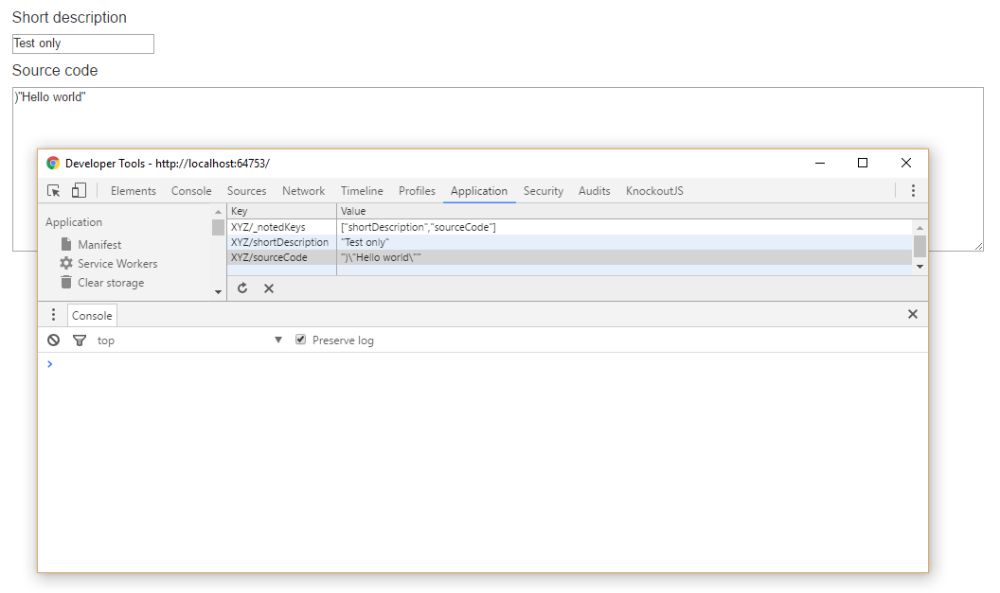

# Angular 2 property decorators
The purpose of this project is to provide a VS 2015 example usage of the extensible property decoration for Angular 2 (and, additionally, a working VS 2015 Angular 2 project to use as a build base). 

Download, build and test. Uses the 'sister' repo here as well (a node module), angular2-extensible-decorators.  

Short blog item [here](http://tb-it.blogspot.co.nz/2016/10/angular-2-using-decorators-for-property.html).

# Example

The properties shortDescription and sourceCode will be automatically serialized and deserialized to window.localStorage.

    import { Component } from '@angular/core';
    import { LocalStorage } from 'angular2-extensible-decorators/components';

    @Component({
        selector: 'app-shell',
        template: '...'
    })
    export class AppComponent {
        @LocalStorage('XYZ') shortDescription: string;
        @LocalStorage('XYZ') sourceCode: string;
    }

Screen grab:

# License
This project is released under the [MIT license](https://opensource.org/licenses/MIT)
